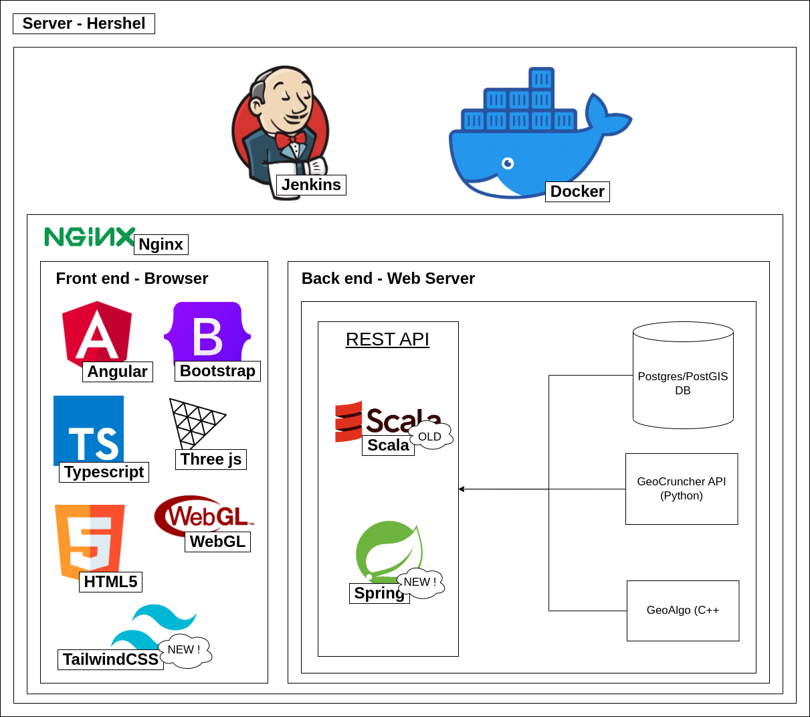

# Architecture
## Description
The web application Visual KARSYS possess a common RESTFUL architecture.

The server of the web application is a [Hetzner server](https://www.hetzner.com/) located in germany.
The structure is built like this :

### Basis
- A Jenkins service is installed to manage the multiple builds and thus the multiple steps of the build process. Each time a new version of the web app is on the git main branches (dev and master), Jenkins launch the pipeline.
- Two docker containers are online. One for development and the other for the production. The builds are always sent first on the development container to test and then later on on the production one.

### Nginx
Nginx is a web server free software, it hosts the different parts of the website and make them communicate between each other.

#### Front end
The front end uses these technologies :
- Angular as its base front end framework
- Typescript as the language
- Bootstrap and TailwindCSS for styling (Bootstrap is being replaced by TailwindCSS)
- Three js for the 3D Viewer and thus WebGL
- HTML 5

#### Back end
The back end has an API which communicates with services used to manage geodatas.
The API is currently in two parts do to an API migration.
We first had a Scala API but the objective is to change it to a Java Spring API.
The services used by the API are :
- Postgres/PostGIS DB, the database with a special configuration for geodatas.
- GeoCruncher API, an API used to compute geodatas and show them in 3D
- GeoAlgo, an API used to compute groundwater bodies and the behaviours
