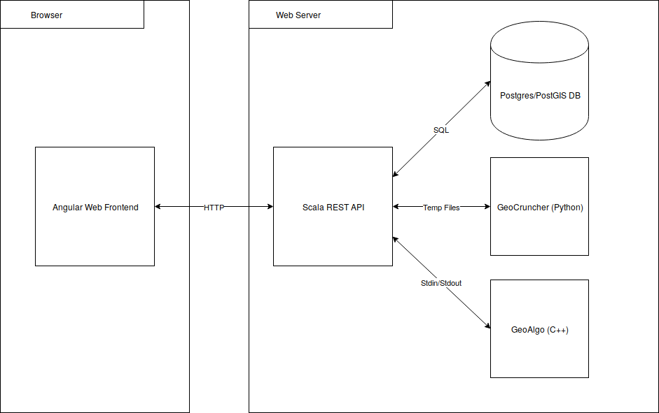

# Architecture

The overall architecture of Visual Karsys is as follows:



The frontend is based on the Angular 11 and is written with TypeScript. The frontend communicates with the Scala backend via a REST API.

The backend, written in Scala, is responsible for database access, data conversion and calling GeoCruncher and GeoAlgo algorithms.

GeoCruncher implements the Geological Model computation used by the integrated geological modelling tool.

GeoAlgo implements the Aquifer computation.

Visual Karsys works on a per-project basis. A project is modelled as an immutable tree, where the project is the root node.

The CI is based on jenkins where all build steps are run in a docker-container, so they are deterministic and do not affect other builds, for improved build speeds we map the caches. After building
and testing all packages we build and tag the docker-image used for dev/prod.

We use docker as it allows us separate all servers and allows us e.g. to update and restart Web CI without affecting the production server. These are split like this:

* build.Dockerfile: shares the same dependencies needed for the server.Dockerfile so they are cached between both of them and in addition contains some more dependencies only needed for building.
* server.Dockerfile: contains all the dependencies and files needed for running server and integration tests.
* dev/prod.nginx.Dockerfile: the nginx server responsible for forwarding the server requests and serving the client assets.
* postgresql.Dockerfile: the postgres database including extensions etc.
* dev/prod.docker-compose.yaml: the docker-compose configuration for running the dev/prod server.

# Angular Frontend

. Below, some starting points and significant components are described. For full details, see the source code.

## Principal areas

**Info site:** The welcome page of Visual KARSYS informs visitors about Visual KARSYS and allows to register or log in to the actual web application.

**Project overview:** When logged in, users are presented with a list of projects they can access. From there, a project may be selected for viewing or for editing in the wizard.

**Project view:** Contains the detail view and outputs. The detail view of a project shows the project metadata and indicates the progress made through the KARSYS process. The output page gives users
an overview of what data has been defined or computed through a 2D map and a 3D view.

**Wizard:** The wizard guides users through the steps of the KARSYS process, and is intended to be used iteratively. The wizard allows users to specify geological data for a project, and to perform
computations based on that data.

**Animation:** The purpose of the animation module is to simulate the effects of rain on the project. The user can edit the scenario of an animation by changing the precipitations, the clouds and the timescale.
The user can also use filters to show or hide certain part of the animation.

There is five views :

`animation-main` : list of existing scenarios and where we can create new one.

`animation-setup` : where we can edit name, change timescale and acces to others settings pages or un the scenario 

`animation-settings` : where we can edit global scenario settings(for all scenarios on this project)

`animation-cloud` : where we can edit the position/size/elevation of the cloud  

`animation-precipitation` : where we can edit the intansity of the precipitation by time period(defined by timescale)

`animation-run` : where the animation is played, we can filter some part of animation. We can save the state of the 
layer-tree

The code that manage the simulation is in the files : `animation-page-3d-viewer.components.ts`, `flow-animation-service.ts`
We re-used a lot of component from the standard 3d view of vk that we prefix by "animation"

The simulation use the voxels that are computed in the geocruncher in the `voxel_computation.py` file. The starting code is similar to the mesh compilation, but instead of using the the marching_cube algo with use the grid directly.
For saving some space and speed-up the parsing we dont save the coordinate of the voxels. To do so we sort the arrays in reverse-nested loop order where z ist the outer loop, y the middle and x the inner loop before we saved to a file. We save only the rank_id returned by gmlib and the Gwb id. To find in which voxels are in a gwb we use pyvista that allow us to test if a position is in a mesh or not.

**Geomodeler Import:**
Vk now allow user to import gemodeler project. That import is still in developpment but we can already import a lot of infos which are :

`Section`: The cross-section are imported but we only import the first image because vk don't support multiple image for one cross-section. We had to adapt because some section are not link to a image so we create an empty gray image as a placeholder.

`Maps`: We can import all the geological maps.  

`Interface`: the interface needed some adaptation because vk only suport line composed by two points, while geomodeler use line composed of unlimited number of point even 1 point interface is possible. So we convert the multipoints line into multiple lines and for the interfaces with one point we create a line with the same start and end.

`Foliation`: The foliation import is pretty straighfoward, as vk and geomodeler use the same parameters. 

`Series`: We import each series of the geomodeler project

`Units`: The units are called formation in gm, we add a windows during the project import to assign the hydraulic infos.

`ESPG`: The espg in geomodeller project isn't mandatory in opposition to Vk. So when importing the project we ask the user to give the espg. geomodeler have a field that as the same use than espg but don't directly match espg so we fetch that field and we put it in the espg search automaticcaly and let the user select the correct one or enter a different one.


## Project Tree

The frontend loads the project tree when a project is opened, containing a full description of it.

Associated large artifacts such as images and meshes are loaded separately using the metadata provided by the object tree.

### ObjectTree

This is the base class for the project tree. The nodes are specialisations thereof, such as `ProjectNode` or `GroupNode<T>`. See `object-tree.ts`.

### UIObjectTree

A wrapper around the regular project tree, which simply adds features like visibility state for visualisation in the UI (e.g. in the 3D Viewer HUD). `UIObjectTreeLoaderService` performs the conversion
from an `ObjectTree`.

### 3D objects

For rendering, the `UIObjectTree` is converted to a hierarchical Three.js scene, structured in the same way as the project tree. `ObjectsTo3DService` is responsible for converting VK objects to their
3D representation. See `objects-to-3d.service.ts`

## Project Data Store

When the user has selected a project, it is accessed through `ProjectDataStore` (see project-data.store.ts). `ProjectDataStore` is used for all object creations, modifications and deletions within a
project. The store is responsible for calling the respective REST service and updating the tree. Internally, changes to the tree are made using modifier functions, which return a new, updated tree.
The store exposes the tree using RxJs observables.

## 3D Viewer

The 3D viewer is based on the [three.js](https://threejs.org/docs) library, and is used in several places throughout the frontend to display parts of the project tree in a 3D representation, e.g. the
surface model, cross-sections and 3D geological models.

The objects to be displayed are defined through a filter condition in the code. Users may then show and hide objects from the selection.

For more details on the 3D viewer and conversion of the project to 3D, see the [3D viewer docs](3d-viewer.md)

## Backend

**model:** Contains the model classes, mirroring mostly the database structure.

**logic:** The database access code and building upon that additional logic like authentication and interfacing with the GeoCruncher/GeoAlgo softwares.

**restAPI:** The REST API exposed to the Visual Karsys client. Concerns itself with providing a HTTP interface and converts data between the wire JSON format and the model classes.

### Model

Package: ch.isska.viskar.model

The models use case classes exclusively. In general, for each database table there is a corresponding model class. Small helper methods may be part of the case classes, but this should be kept at a
minimum. Enums are represented using ``sealed trait``s/``case object``s.

To be able to generate random values for testing purposes, the object ch.isska.viskar.model.ArbitraryInstances contains ``Arbitrary`` definitions for all model classes. If you create or adapt a model
class, you most likely need to create or update the corresponding ``Arbitrary`` definition.

### Logic

Package: ch.isska.viskar.logic`

Contains all database access code as well as some further functionality such as Authentication, imports and exports etc..

The database access code resides in the ``ch.isska.viskar.logic.db`` package. For each entity, there is a ``XYZTable`` class providing the required SQL operations. The SQL queries are implemented
using [doobie](https://tpolecat.github.io/doobie/). Here is an example select query for the geological model:

     private[db] def qryGet(accountId: Option[ID], modelId: ID): Query0[MGeologicalModel] =
       sql"select id, project_id, owner_account_id, created, modified, resolution from geological_model where id = ${modelId} and vk_has_project_permission(${accountId}, project_id, 'can_view')".query

The query uses the ``sql`` doobie string interpolator, which takes care of parameter handling and escaping. The query itself uses the ``private[db]`` access modifier, as it is only used internally and
in the tests. Inside the ``ch.isska.viskar.logic.db.schema_tests``, there is a Doobie test for each ``XYZTable`` class. The test checks that the SQL schema and the query match the Scala type into
which the result is stored. E.g. it catches if fields are mixed up, have wrong types etc..

The query itself is exposed publicly using a small wrapper function:

      override def get(id: Long): LogicM[Option[MGeologicalModel]] = for {
        accId <- LogicM.getAccountId
        r <- LogicM.db(qryGet(accId, id).option)
      } yield r

The wrapper function performs the necessary setup, e.g. it retrieves the current account id from the environment for the permission checks. All such functions are defined using the ``LogicM``
datatype (a Monad). The individual available operations can be seen in ``ch.isska.viskar.logic.monad.base.LogicM``. Individual operations can be combined either using the ``LogicM.flatMap`` function
or by using Scala for comprehensions as in the example above.

### Permission Checks

Permission checks are carried out directly in the SQL queries as far as possible. The SQL functions ``vk_has_project_permission(ACCOUNT_ID, PROJECT_ID, REQUESTED_PERMISSION)`` returns true if the
user ``ACCOUNT_ID`` has the requested permissions. If the user has no permission, a ``LogicMError`` is thrown using ``LogicM.throwError``.

### REST API

package: ch.isska.viskar.restAPI

Provides the REST API endpoint, handles data transformation and user authentication. There is one service per entity type with its own file. Note that the REST API services contain separate case
classes used for the JSON serialization. They often mirror the model classes closely, but are kept separate to decouple the model/db evolution from the REST API format. Additionally, the REST API
occassionaly returns slightly different fields than the model classes contain.

We use Circe for the JSON conversion. You should import the ``ch.isska.viskar.restAPI.BaseTypes`` object in all REST services, as it contains some basic Circe JSON conversion rules. For your specific
entity, you should create the appropriate case classes in the corresponding Scala file:

    case class CrossSection(
      id: Option[Long],
      name: String,
      ...
      modified: Option[DateTime],
      imageVersion: Option[Int]
    )

You also need to define the Circe JSON conversions, but these can be automatically derived using ``deriveEncoder``/``deriveDecoder``:

    implicit val decodeCrossSection: Decoder[CrossSection] = deriveDecoder
    implicit val encodeCrossSection: Encoder[CrossSection] = deriveEncoder

For datatypes used as top-level entities in HTTP requests, you furthermore need to define corresponding http4s de-/encoders:

    implicit val jsonDecoder = org.http4s.circe.jsonOf[CrossSection]
    implicit val jsonEncoder = org.http4s.circe.jsonEncoderOf[CrossSection]

This enables you to write your first REST method:

    "Documentation ..." **
      GET / pathVar[Long]("id") |>> { (id: Long) =>
      crossSectionTable.getOrThrow(id).map(x => Ok(CrossSection.fromModel(x)))
    }

If a ``LogicMError`` is thrown in the computation, the appropriate HTTP status code is automatically returned.

#### REST API jobs websockets

As jobs may take a long time to compute and to avoid client timeout on HTTP request, jobs are requested and returned using websockets. All types of computation do nearly the same procedure namely:

1. Client asks for a job (either `Compute` or `Get`) using a specific URL, server starts computing or getting data
2. Every 10 seconds, server will ping client to keep the connection active
3. Once the job is completed the server will send the job back either with the data inside the JSON directly (for `Slices` or `Intersections`) or it should have saved the data in DB (for `Meshes`
   and `GroundWaterBodies`) for later HTTP request and just send the job result

##### Using the ticket-based authentication for websockets

As websockets are not secured, to authenticate users, we use a ticket-based authentication system:

1. Client asks through the secure HTTPS connection for a ticket
2. Server generate a random hash, store it locally with the client info and sends back the ticket to the client
3. Client opens websocket connection
4. Client sends the ticket as its first message
5. Server can link the websocket connection to the client using the ticket it received

If the client does not send the ticket as its first message, sends a wrong or expired (already used) ticket, the server will close the websocket connection immediatly with the code `1008 policy error`
.

##### Implementation

**Client side:**

Wrap your websocket connection using the `AuthWebSocketService` and `AuthWebSocket`:

```
this.authWebSocketService.connect(url).subscribe(authWebSocket: AuthWebSocket => {
  // Use authWebSocket as the WebSocket (with: onopen, onmessage, etc)
});
```

**Server side:**

Just use the `WebSocketAuthService`'s wrappers:

`def fromClientAuthWrapper[A >: Null](fromClient: (ID, WebSocketFrame) => Unit, queue: Queue[(Option[ID], A)]): Sink[Task, WebSocketFrame]`

`def toClientAuthWrapper[A](toClient: (ID, A) => WebSocketFrame, queue: Queue[(Option[ID], A)]): Process[Task, WebSocketFrame]`

to ensure that client was authenticated before anything else.

### Licensed content

Content can be limited to privileged users. To limit such content admins can activate a license in the admin console (``/vk/admin``).

Account will be active once the user logout and login again or after max a month (duration of the token).

To prevent non-licensed user to use licensed content, on the backend extend:

```
abstract class LicenseFeaturesLogic[A] {
  protected val value: A

  def isLicensedContent: Boolean = false
  def isPossible: Boolean = true

  def getOrElse(default: A): LogicM[A]
  def getOrThrow: LogicM[A]
}
```

And use `getOrThrow` or `getOrElse` to limit the value based on `isLicensedContent` and `isPossible`.

Users that had their license revoked will see licensed content until they logout and login again or after max a month. To prevent these users to see licensed content, the token should be refreshed on
the server's first unauthorized response. For example for a websocket connection:

```
err => {
  // Do on error...

  if (err.code === 1006) {
    this.authService.forceRefreshAccessToken().subscribe();
  }
}
```

### How to add a new field

This is a step-by-step explanation on how to add a new field to an entity.

1. Add a new SQL migration in ``src/server/logic/src/main/resources/db/migration``, adding the new fields to the database.

2. Add the new field to the correspondig case class in ``src/server/model/src/main/scala/ch/isska/viskar/model/package.scala``.

3. Update all the queries inside the appropriate ``src/server/logic/src/main/scala/ch/isska/viskar/logic/db/XYZTable`` class. Note that the order of fields in the SQL query and the case class have to
   match.

4. Add the new field to the corresponding case class in the ``src/server/restAPI/src/main/ch/isska/viskar/restAPI/XYZ`` service and expand the ``xyzFromModel`` and ``xyzToModel`` definitions.

Hints:

- You can follow the compile error messages to see what you need to fix once you have added the new case class fields

- If you want to make a new field optional, use the ``Option[T]`` datatype

- You can use the ``XYZTest`` to verify that the SQL queries fit the case classes. To run, open the ``XYZTest`` in Idea, right click and select "Run XYZTest".

# GeoCruncher

Provides an interface between Visual Karsys and the gmlib library from BRGM. It is a python program that is started with the appropriate parameters. Actual data is transferred via temporary files.

# GeoAlgo

The GeoAlgo directory is intended to contain algorithms for geological computations, e.g. on 3D meshes. Currently it contains the algorithm for groundwater body computation (see: VK-Aquifers).

## VK-Aquifers

This is a C++ application, which performs the calculation of groundwater bodies, given one or more geological 3D meshes and their springs. A groundwater body is determined by cutting the meshes at the
height of a spring and finding connected meshes, to which the water "flows".

* **Compilation:** Use CMake to generate a project for your IDE and build correspondingly. Requires CGAL 4.13 or later.
* **API:** The algorithm can be accessed by entering commands manually in the console, or through standard input (`stdin`).
* **Implementation:** The algorithm uses the [Computational Geometry Algorithms Library (CGAL)](www.cgal.org/). See the VK-Aquifers source code for details, primarily `AquiferCalc.cpp`.
* **Output:** The meshes of all groundwater bodies are generated and saved to disk in [OFF format](https://en.wikipedia.org/wiki/OFF_(file_format)). For each groundwater body, the principal spring and
  geological unit are returned.
