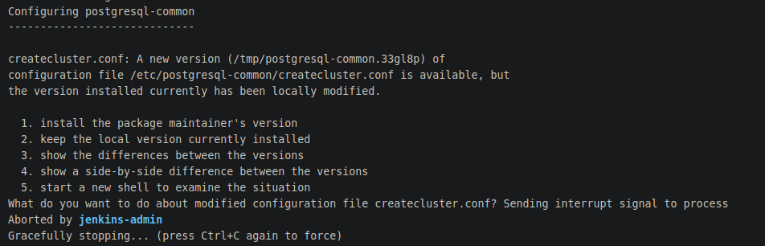

# Docker
The docker services are used a lot for the Visual Karsys project. All the environments are created with it.

## Server
A development environment named dev and a production environment named prod are created on the server. Both of them have a dockerfile configuration in the docker folder.

## Local
In the local computer, the developpment computer, docker has :
- docker-ce 5:22.06.0~beta.0-0~ubuntu.18.04.0~bionic
- docker-ce-cli 5:22.06.0~beta.0-0~ubuntu.18.04.0~bionic
- docker-ce-rootless-extras 5:22.06.0~beta.0-0~ubuntu.18.04.0~bionic
- docker-compose 1.25.0-1
- docker-scan-plugin 0.21.0~ubuntu-focal
- docker.io 20.10.1-0ubuntu1~20.04.2

Docker is employed locally to generate containers used for developpments purposes (Server container, database container, ...)

### Problem
Automatic updates were done and messed up with docker version. Moreover, some unwanted plugins were automatically installed and changed the purpose of used commands in certain scripts :
- docker-buildx-plugin 0.8.2~ubuntu-bionic
- docker-compose-plugin 2.12.2~ubuntu-focal

Making launching the server locally impossible.

The docker command which was in the 'run-server.sh' script was then unusable :
```shell
docker buildx install
```

Due to the updates, buildx became builtin and an alias was not required anymore.
This is why this specific line was put under a comment.

With this change, the server could be launched once again normally.

## Server

With the suppression of old docker images the cache was also deleted to free disk space. [Jenkins space problem](../jenkins/troubleshooting.md#no-space-left-on-device)

With the cache cleaned, the images created during the build pipelines were having some problems.

1. The first problem happened at the "client" step : The node image's version was then too recent and a problem occurred with openssl and node js v17 and above : [Digital envelope routines unsupported](https://stackoverflow.com/questions/69692842/error-message-error0308010cdigital-envelope-routinesunsupported). The Jenkinsfile used the 'latest' version for the node image, the solution was to downgrade node js to vesion 16 or below.
2. The second problem happened at the "integration test" step : the postgres image had a preexistant configuration and the build asked the user a choice on what to do with it.  However, no input was possible with Jenkins console. The solution was to delete the configuration file and the installation created a new one.
3. The third problem also happened at the "integration test" step : the locale used by the postgres images was incorrect, this bug is normally resolved in higher versions of the image, however, due to the project being old, this change in version could be a break change. The solution was to add the next command to the dockerfile :
```bash
RUN localedef -i en_US -f UTF-8 en_US.UTF-8
```
