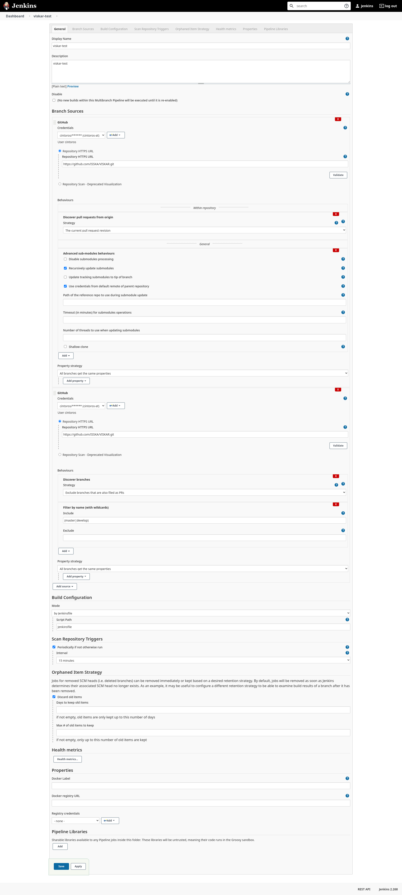

# Jenkins - CI

For the server(ubuntu 18.04) we choose the LTS Jenkins release as described here https://www.jenkins.io/doc/book/installing/linux/#debianubuntu including the current java LTS `openjdk-11-jdk`
The HTTP_PORT in `/etc/default/jenkins` was set to 8090 to prevent conflicts with the old hydra server.

A local install can be based on https://wiki.archlinux.org/index.php/Jenkins as the jenkins version does not really matter to much locally.

For more information about our Jenkins-Pipeline-Setup see https://www.jenkins.io/doc/book/pipeline/getting-started/ https://www.jenkins.io/doc/book/pipeline/docker/

## Architecture

### Pipeline

* steps: all build steps are run in a docker-container, so they are deterministic and do not affect other builds, for improved build speeds we map the caches.
    * client: build the frontend & run checks (code-style, audit)
    * sec-export: build the sec-export
    * geo-algo: build & test the geo-algo
    * geocruncher: build & test the geocruncher and related libraries
    * server: build & test the server
    * integration: test the server over docker-compose using the same image as used in production
    * master/develop publish: build and tag the docker-image used for production.

### Docker

* ci-it/dev/prod.viskar.conf: contains the viskar server config for the ci-it/dev/prod, these are all copied into the final server.Dockerfile and selected at runtime over environment variables.
  `"JAVA_OPTS=-Dconfig.file=/usr/conf/prod.viskar.conf"`
* build.Dockerfile: contains all the dependencies needed for building the c/python packages of the server.
* build.sbt.Dockerfile: contains all the dependencies needed for building the sbt server.
* server.Dockerfile: contains all the dependencies and files needed for running server and integration tests.
* dev/prod.nginx.conf: the nginx config for the servers the only difference is in the server_name.
* dev/prod.nginx.Dockerfile: the nginx server responsible for forwarding the server requests and serving the client assets.
* ci-it.docker-compose.yaml: the docker-compose configuration for running the integration test. The integration test use the same dockerfile, so we test against the actual versions etc. used by the
  production docker-compose.
* dev/prod.docker-compose.yaml: the docker-compose configuration for running the dev/prod server.

The Dockerfiles are organized so that the big parts such as all the dependencies (2GB) are cached and only build once. The other build steps are organized, so we can cache some steps, this could be
further optimized but is not important right now.

```console
root@server:/# docker history viskar/viskar-server-dev:latest
IMAGE               CREATED             CREATED BY                                      SIZE                COMMENT
32c0bcb3644a        20 hours ago        /bin/sh -c #(nop) COPY file:d10c5c08f9126771…   908B                
7c209327a08b        20 hours ago        /bin/sh -c #(nop) COPY file:9d1e7c88cdaac9fe…   947B                
85181fa191f4        20 hours ago        /bin/sh -c #(nop) COPY file:af54b66a1991339f…   905B                
bec455787897        20 hours ago        /bin/sh -c #(nop) COPY multi:93116203ef54490…   21.1MB              
52cdea6055de        20 hours ago        /bin/sh -c #(nop) COPY file:9f4d04a275829b0f…   12.7kB              
778f952d277e        20 hours ago        /bin/sh -c #(nop) COPY multi:9a5fec44a0335f4…   14MB                
722d5fb969f6        20 hours ago        /bin/sh -c #(nop) COPY file:b8b51778aba86abb…   12kB                
c39015426f7f        20 hours ago        /bin/sh -c #(nop) COPY multi:0a1cf9c9acba26a…   93.8MB              
75a2bb7e5d69        20 hours ago        /bin/sh -c #(nop) COPY file:14f58b22483d68f5…   13.9kB              
0380762ba41f        20 hours ago        /bin/sh -c pip3 install dist/gmlib-0.3.9-cp3…   1.17MB              
5f81e23f75c2        20 hours ago        /bin/sh -c pip3 install dist/geocruncher-*.w…   31.9kB              
efd31839029e        20 hours ago        /bin/sh -c pip3 install dist/MeshTools-*.whl    6.02MB              
5b17807a1d3e        20 hours ago        /bin/sh -c #(nop) COPY dir:05551acaa5c520573…   2.87MB              
1651f4856fbf        21 hours ago        /bin/sh -c #(nop) COPY file:e095b6266aaf10eb…   15.1MB              
7556bd0c3bbc        21 hours ago        /bin/sh -c #(nop) COPY file:d8a09eae19f1b1df…   75.7kB              
a4036106e9f1        7 days ago          /bin/sh -c apt-get update && apt-get upgrade…   2GB                                  
...
```

## Initial Setup/Config

1.`pacman install jenkins`
1.`usermod -aG docker jenkins`

1. login http://localhost:8090
1. install suggested plugins
1. http://localhost:8090/view/all/newJob
1. Install additional Plugins http://localhost:8090/pluginManager/available
    1. Docker Pipeline
    1. Warnings Next Generation
    1. forensics
1. create directories and set the user `chown -R jenkins:jenkins .yarn .sbt .npm .m2 .ivy2 .cache`
1. allow jenkins user to restart services:
    1. `visudo`
    1. `jenkins ALL=(ALL) NOPASSWD: ALL`
1. Multibranch Pipeline (for local testing generate an access token)
   

## Services

- `pushd /etc/systemd/system`
- `ln -s /root/VISKAR/src/docker/dev.docker-compose.service`
- `ln -s /root/VISKAR/src/docker/prod.docker-compose.service`
- `popd`
- `systemctl enable --now dev.docker-compose prod.docker-compose`
- for restarting the service use :`systemctl restart dev.docker-compose prod.docker-compose`
- for accessing all logs e.g: `journalctl -et viskar-server-prod`
- for accessing specific logs e.g: `journalctl -e CONTAINER_NAME=docker_viskar-server-prod_1`

## Nginx Mapping

The `/etc/nginx/sites-enabled/nginx_visualkarsys.config` defines the mapping used by our server.

```
##
# You should look at the following URL's in order to grasp a solid understanding
# of Nginx configuration files in order to fully unleash the power of Nginx.
# https://www.nginx.com/resources/wiki/start/
# https://www.nginx.com/resources/wiki/start/topics/tutorials/config_pitfalls/
# https://wiki.debian.org/Nginx/DirectoryStructure
#
# In most cases, administrators will remove this file from sites-enabled/ and
# leave it as reference inside of sites-available where it will continue to be
# updated by the nginx packaging team.
#
# This file will automatically load configuration files provided by other
# applications, such as Drupal or Wordpress. These applications will be made
# available underneath a path with that package name, such as /drupal8.
#
# Please see /usr/share/doc/nginx-doc/examples/ for more detailed examples.
##

# Default server configuration
#
server {
        listen 80 default_server;
        listen [::]:80 default_server;

        server_name www.visualkarsys.com dev.visualkarsys.com visualkarsys.com hydra.visualkarsys.com;
        return 301 https://$host$request_uri;
}


ssl_certificate /etc/letsencrypt/live/visualkarsys.com/fullchain.pem; # managed by Certbot
ssl_certificate_key /etc/letsencrypt/live/visualkarsys.com/privkey.pem; # managed by Certbot

server {

        # SSL configuration
        #
        listen 443 ssl ;
        listen [::]:443 ssl ;

        server_name visualkarsys.com; # managed by Certbot


        location / {
                return 301 https://www.visualkarsys.com$request_uri;
        }
}

server {

        # SSL configuration
        #
        listen 443 ssl ;
        listen [::]:443 ssl ;

        server_name hydra.visualkarsys.com; # managed by Certbot

        location / {
                proxy_pass "http://127.0.0.1:8090";
                proxy_set_header Host $http_host;
                proxy_set_header X-Real-IP $remote_addr;
                proxy_set_header X-Forwarded-For $proxy_add_x_forwarded_for;
                proxy_set_header X-Forwarded-Proto $scheme;
        }
}

server {

        # SSL configuration
        #
        listen 443 ssl ;
        listen [::]:443 ssl ;

        server_name dev.visualkarsys.com; # managed by Certbot

        location / {
                proxy_pass "http://127.0.0.1:8003";
                proxy_set_header Host $http_host;
                proxy_set_header X-Real-IP $remote_addr;
                proxy_set_header X-Forwarded-For $proxy_add_x_forwarded_for;
                proxy_set_header X-Forwarded-Proto $scheme;
                proxy_set_header X-Forwarded-Host $host;
                proxy_set_header X-Forwarded-Server $host;
                proxy_set_header Accept-Encoding "";
                # necessary for image uploads
                client_max_body_size 200m;
                proxy_read_timeout 600s;
                proxy_http_version 1.1;
                proxy_request_buffering off;
                proxy_buffering off;
                # necessary for websocket
                proxy_set_header Upgrade $http_upgrade;
                proxy_set_header Connection "upgrade";
	}
}

server {

        # SSL configuration
        #
        listen 443 ssl ;
        listen [::]:443 ssl ;

        server_name www.visualkarsys.com; # managed by Certbot

        location / {
                proxy_pass "http://127.0.0.1:8004";
                proxy_set_header Host $http_host;
                proxy_set_header X-Real-IP $remote_addr;
                proxy_set_header X-Forwarded-For $proxy_add_x_forwarded_for;
                proxy_set_header X-Forwarded-Proto $scheme;
                proxy_set_header X-Forwarded-Host $host;
                proxy_set_header X-Forwarded-Server $host;
                proxy_set_header Accept-Encoding "";
                # necessary for image uploads
                client_max_body_size 200m;
                proxy_read_timeout 600s;
                proxy_http_version 1.1;
                proxy_request_buffering off;
                proxy_buffering off;
                # necessary for websocket
                proxy_set_header Upgrade $http_upgrade;
                proxy_set_header Connection "upgrade";
        }
}
```
