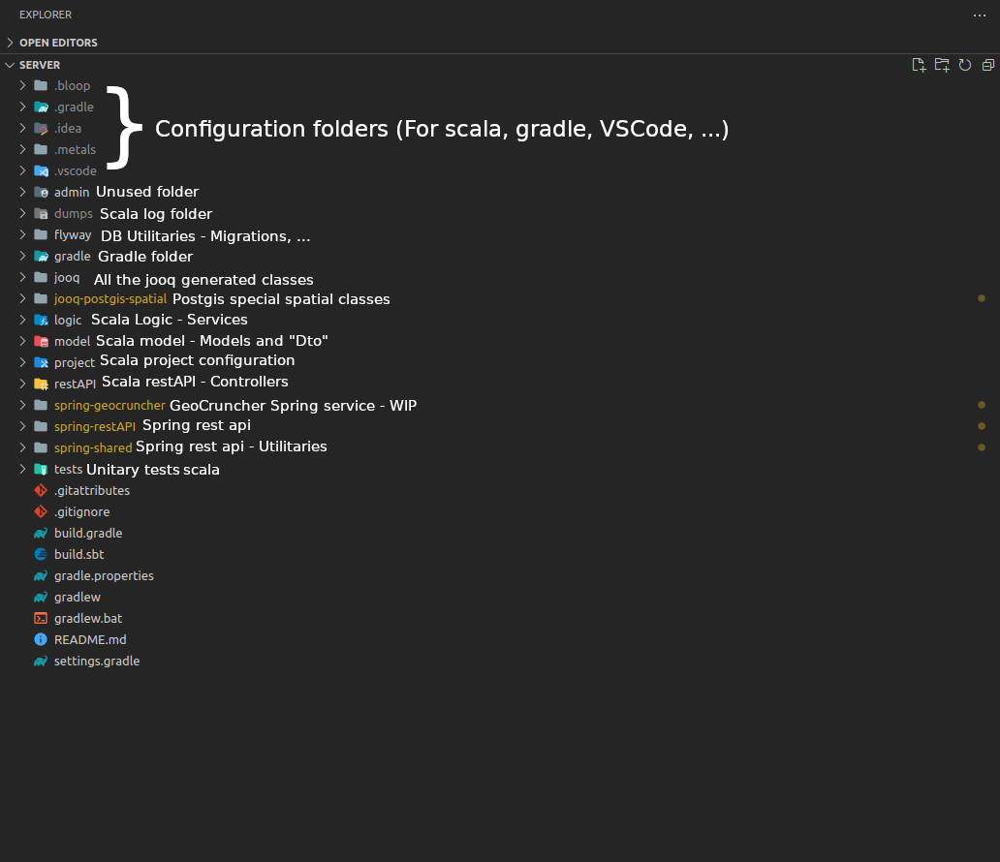
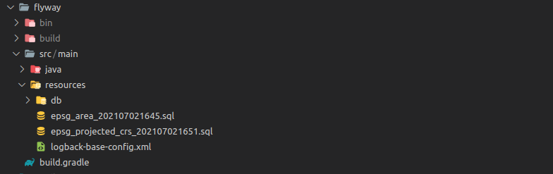
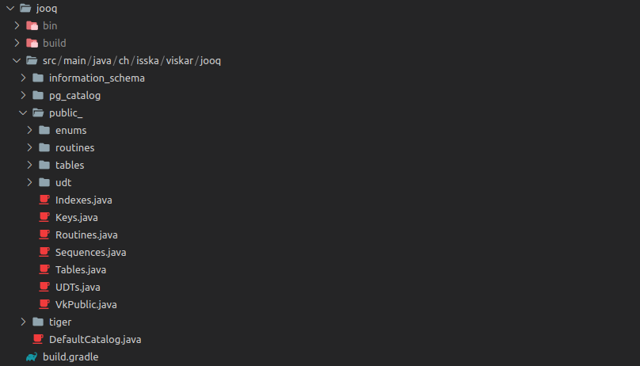
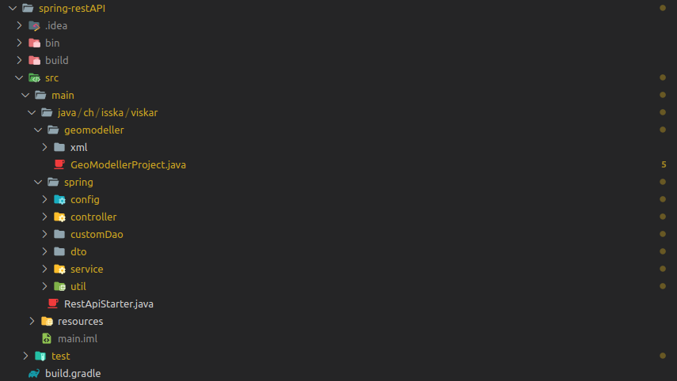
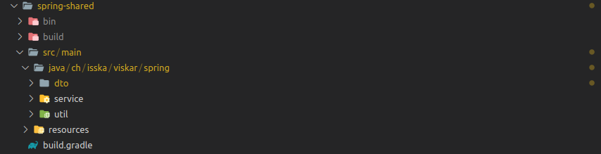

# Backend structure
In this file, the folder structure of the server folder (Backend) is explained



In this image, the whole backend architecture is shown. The important folders are :
- flyway ; The migrations and DAO management are here
- jooq ; Containing all the jooq generated classes, to not modify but to be used
- jooq-postgis-spatial ; Containing all the specific postgis spatial classes
- spring-geocruncher ; The geocruncher routes but in Java (WIP)
- spring-restAPI ; Where the main API is, and where the migration from scala to java is done
- spring-shared ; Important classes and elements used during the migration, will be removed once the migration is done.

The other folders are either not used anymore, have simply configuration purposes or are to be removed, for example the scala api parts. We keep them for now, but once the migration is done, they are to be removed to only have the Java Spring part.

## flyway
In the flyway folder resides all the migrations. More precisely, in the migration folder.

```bash
VISKAR/src/server/flyway/src/main/resources/db/migration
```



## jooq
The Jooq folder contains all the jooq generated classes :
- enums - Enums defined in the database
- routines - Triggers, functions, ...
- tables
  - daos
  - pojos
  - records
  - tables
- basic database elements



## jooq-postgis-spatial
This folder only contains very specific classes for geodata uses.

## spring-geocruncher
This folder will contains the future adaptation of the geocruncher service. Which is currently implemented in scala.

## spring-restAPI
The spring-restAPI folder is separated in two first folders.



- geomodeller
  - geomodellerproject : Class that manage the import of projects coming from geomodeller.
- spring : the whole api logic
  - config : configuration classes, beans, ...
  - controller : all the controllers
  - customDao : daos which inherits jooq dao and add new specific functionnalities
  - dto : custom dtos, rarely used and only for certain purposes
  - service : services which act as bridge between the controllers and the daos
  - util : utilitaries classes

There is also the resources folder which contains templates (mail templates for examples) and some important data.

And finally the test folder which contains the unitary tests for the spring api.

## spring-shared

In this folder resides the classes called 'MClasses'. These classes act like dtos but are really specific.
They were created for the migration and are dtos which correspond to the data used in the frontend. They are to be removed but are used for now to communicate with the frontend.


