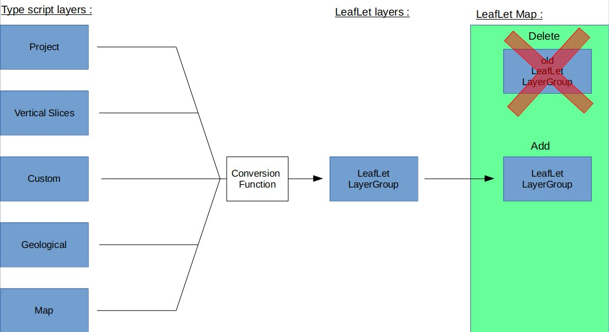

Leaflet technical documentation
===============================
This section describes the way leafLet is used within Visual Karsys. For a more in dept description or for a leaflet tutorial please visit: https://leafletjs.com/ .

### Introduction

Leaflet is a open-source JavaScript library that allow to create a map within any application. This map look like google map, the user can zoom in and out and any part of the world can be displayed.

### Loading maps with WMS and WMTS"

The very core of leaflet is to display a world map that you can interact with. However, Leaflet in itself is just a library that does not contain any maps to display. This is where WMS (Web Map Service) and WMTS (Web Map Tile Service) enter in play. These two are very similar (the only difference being code for integration and performance but they have the same usage), to initialize a leafLet map the only thing you need is to set the zoom , set the original coordinates and provides a link for one WMS/WMTS. Then leafLet will automatically manage everything related to the WMS/WMTS and send request to the map server while the user is using the map to its convenience.

The hard part of using leafLet is finding links for WMS/WMTS, leafLet only accept links in this form:  
http://server/option/{x}/{y}/{z}.png   
While the end is always {x}/{y}/{z}.png/jpg everything else heavily depends on the server which is sharing data, this means the link have to be adapted depending on the data provider. 

* For example it can go from very simple (this is a free world map):  
    http://tile.osm.org/{z}/{x}/{y}.png  

* To complicated (this is a template request for a topographic map from SwissTopo):  
    https://wmts.geo.admin.ch/1.0.0/${id}/default/${time}/3857/{z}/{x}/{y}.${format}  
    More info about SwissTopo API here: https://api3.geo.admin.ch/  

Moreover there is modification to do depending on the access authorisations. For example SwissTopo gives some map for free but you have to identify yourself, you can't just request. These variations depends entirely on the host data providers. The problem being that the map wanted for visual karsys are mostly not freely and easily available maps but topographic map coming from different countries which all have different ways of sharing them (if they do, or even if they have a WMS/WMTS).

Also a small note:
 
1. Leaflet allow any parts of the world to be viewed at any zoom level (0-12). However the vast majority of WMS/WMTS do not return a map for all the possible coordinates, the exception being the world maps but any specialized map is often very localized. This means that many bad request can be sent and you will have many error 404, to avoid this you can delete the map if an error is encountered (leaflet manage bad request) or simply do not allow the user to go over certain limits.
    
### Using leafLet In VisualKarsys

We have talked for now about the usage of most common usage of leafLet which is to display a world map you can interact with, but what are the specialized things leafLet is used to achieve within visual karsys?

There are two type of thing that will be displayed by leaflet in addition to WMS and WMTS.

1. Images
Leaflet can display images anywhere as long as you specify 3 corners. The images are used to display very complex thing that could not simply be described with a few points or markers. For now images are all displayed within the project boundaries, filling them totally. The image are either imported (like the DEM provided by the user) or created within visual karsys.The  image created within visual karsys are made with another library: plotly (the description on how images are produced is within plotly technical doc). The useful fact to remember for leaflet is that image are computed and then an irl is produced in order to display them on the map.

2. Shapes/Markers
Shapes and marker all come from leafLet draw plug-in. The are all composed of points which have lat and lng coordinates. The huge advantage of these is that you can interact with them, read data, modify etc.. Whereas with images you can just display them and act on opacity only. Shapes are used to display cross-section, slices, springs, project boundaries, drill-holes and mostly to allow the user to customize the map.

### Basic review of data structure

The output page 2D map is composed of the map itself and the layer manager. The both are NOT directly linked in our data structure, we have chosen the following approach:

1. Views
A whole set of layers is called a "view". One view is composed of five arrays that contains every layer as typescript class (five arrays so we sort them by relevant types). The arrays have nothing to do with leaflet yet. When you add an element to the map (be it a WMS an image or a shape) one layer is pushed in the view's corresponding array.

Those are the arrays composing one view:
* Project
* Vertical slice
* Custom
* Geological
* Map

2. From typescript to leafLet
With leaflet you can add delete or customize a layer on the map. However, they have to be created and stored within typescript. Since we already have typescript class and since it is way easier to handle typescript classes rather than complex leaflet layers we have chosen NOT to save each typescript layer as its leafLet counterpart.

Instead of handling each array separately we handle them all together. The only link between the 2d map and the layer manager is a transcription function. This function takes all of the view's arrays and transform each element one by one into their leaflet counterpart. Effectively this means that each time we want to plot something on the map, we destroy everything that is on the map, then we convert the actual view into one big layerGroup, then we add it to the map.

3. A little scheme

The good part is that we have only one data structure and not one for leaflet and one for the data manager competing. The downside is that we can't act directly on the map and have to replot every element of the layer manager for any changes (even just re-displaying one layer that was already created).

### Customised tool and interactions.

Leaflet has a lot of pre-made tools and a lot of libraries, it mostly manage everything automatically. However there a huge downside to this: you can't easily interact with the map. The only possibility to make custom maps interactions is through event. Event are pre-set actions that triggers where you can put your own code. 

For example: It is needed to be able to create our own shapes. To do so we use the event draw:created which is called each time a shape is created, we then can convert the shape and add it to the right layer.

However many action can trigger the same event. When creating a slice (a polyline with two points only) the event "draw:created" will be fired. However we want a slice and not a custom shape to be created. To be able to manage this a Mode system has been implemented, a value named MapEditMode is attached to the output page and can take many different values.

MapEditMode:
* Inactive
* ToolbarDraw
* SliceDraw
* CreateCustomShape
* AddCustomShape

Then for each event that can be triggered a case for each mode have to be covered. By doing this we can employ the same event for many things and be sure not to do the wrong thing. This also allow not to do two things at the same time, as it is possible to start drawing a shape and then try to start defining a slice.

Also a small note:
    
1. If a new custom interaction needs to be implemented, it is important to not forget to return to the "Inactive" mode before beginning the new mode. This means not only changing the mode value but also interrupting the creation that was currently taking place (this has to be done manually for each other mode).
