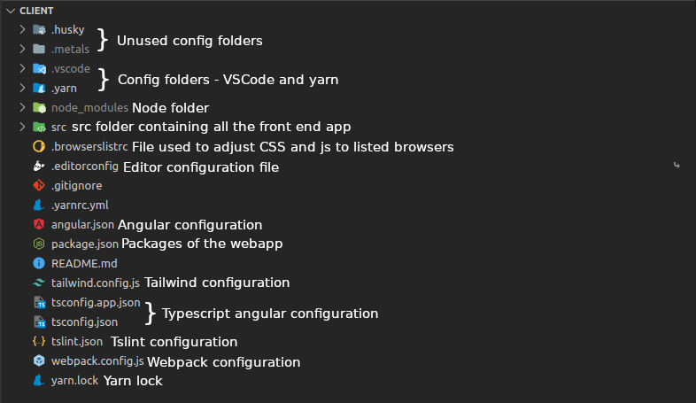
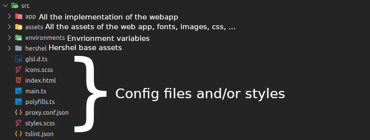
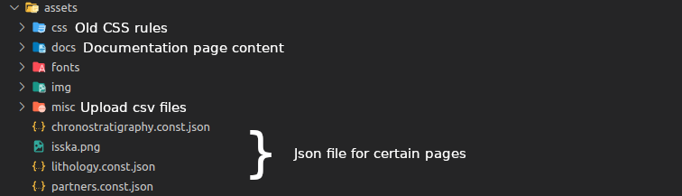
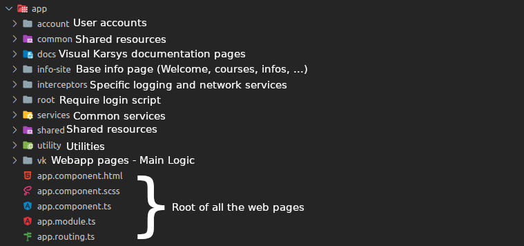

# Frontend structure
In this file, the folder structure of the client folder (Frontend) is explained

In this image, the content of the client is displayed.
The important parts are :
- src ; this folder contains the whole web app
- package.json ; this file is the configuration and packages of the webapp, all the package installed are listed there
- tailwind.config.js ; this file is the configuration of tailwind, the custom rules, custom colours etc are listed here

The others files and folders are either configuration items which are barely touched or installation files.

## src
The src folder contains the files of the webapp and it is separated in different folders

The most important files and folders :

- app ; This folder contains all the logic of the front end
- assets ; All the website assets are in this folder
- styles.scss ; The new tailwind css specific rules are created in this file

### assets

### app

