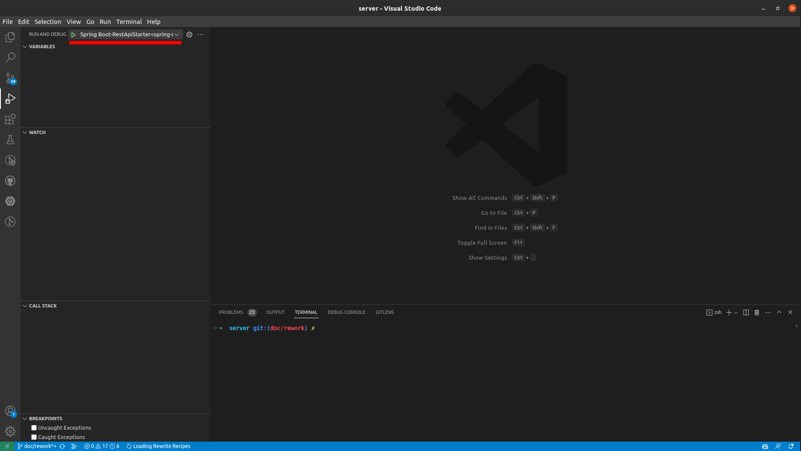

# Controls and commands
Here are the multiple commands and shortcuts frequently used to work on Visual Karsys.

## Ubuntu shortcuts
***SUPER <=> Windows key***

- To open a terminal : SUPER + T
- To open a new tab in a terminal : Ctrl + Shift + T
- To see the opened softs : SUPER
- Shift between activites : Alt + Tab

## Commands

### Start the local development environment
To start the environement to work there are multiple steps to do.

- In a new terminal or tab, go to the VISKAR folder root and start the run server script in order to start the docker containers and the whole environment launchers

```bash
cd VISKAR
./run-server.sh
```

- In another terminal or tab, start the front end with

```bash
cd VISKAR/src/client
yarn start
```

- Once the two processes are started completely, you can open the two folders with Visual Studio Code.

```bash
cd src
code server
code client
```

- It will open Visual Studio Code on both of these folders
- Then you can start the Java Spring server with either the start button in the visual studio code environment (server folder) or start it in a new terminal



```bash
cd VISKAR/src/server
./gradlew spring-restapi:bootrun
```

- Finally, you can launch the front end app by clicking on the same button on the Visual Studio Code environment (client folder) or simply go to the localhost::3000 adress.

### Create a new migration
Go to 

```bash
cd VISKAR/src/server/flyway/src/main/resources/db/migration
```

Create a new migration, increment the id number to match de previous number (If the last migration has the id 176, then the new migration you just created is 177).

Then use the command

```bash
./gradlew generateJooq
```

Which will call flywayMigrate to proceed to migrate and add the corresponding changes to the Jooq code and to the database.

### Connect to the distant server
```bash
ssh root@visualkarsys.com
```

The password is on the Password vault in trello

### Access database command line
```bash
docker exec -it docker_postgis-dev_1 bash
docker exec -it docker_postgis-prod_1 bash
su postgres
psql
\c viskar
```

### Exit ssh server
#### Exit psql
\q

#### Exit docker container (without stopping it)
ctrl+p and ctrl+q

#### Exit ssh connection
exit

### Access all logs

```bash
journalctl -et dev.docker-compose
journalctl -et prod.docker-compose

- for accessing all logs e.g: `journalctl -et viskar-server-prod`
- for accessing specific logs e.g: `journalctl -e CONTAINER_NAME=docker_viskar-server-prod_1`
```

### Reboot server
```bash
reboot
```

or

```bash
systemctl restart dev.docker-compose
systemctl restart prod.docker-compose
```

### Kill a process on the server
```bash
htop
# find the process and get its pid
kill -9 pid
```

### Merge on master
First check that **no jobs** are currently running before starting the merge at : **https://www.visualkarsys.com/vk/job**

Make sure everything in develop has been tested and approved
Locally:

```bash
git checkout master
git pull
```

Make sure there are no pending changes locally.

```bash
git merge develop # accept default merge message
git push
```

Finally, clean master by fast forwarding develop to it

```bash
git checkout develop
git pull
git merge master --ff-only
git push
```

### Restarting Jenkins
After merging a PR, Jenkins stopped being able to build. Reverting the PR did not make it work again.
In that situation, restarting Jenkins made it work again.

Visit the following URl in the browser, then click on the button to restart Jenkins.
It should take less than a minute to restart.

**https://hydra.visualkarsys.com/safeRestart**

### Extract voxels from database
Get inside the database container.

Replace X with the project ID to get voxels for.

To get voxels as bas64:

```bash
psql -d viskar -U postgres -Atc "select encode(voxels,'base64') from voxels_files where project_id = X;" >/voxel-file-01.b64
```

Alternatively, to convert back to binary:

```bash
psql -d viskar -U postgres -Atc "select encode(voxels,'base64') from voxels_files where project_id = X;" | base64 -d >/voxel-file-01.bin
```

Copy the file outside of docker, then to the local machine (if you are using SSh to access the server)

```bash
docker cp docker_postgis-dev_1:/voxel-file-01.b64 /root/voxel-file-01.b64
scp root@visualkarsys.com:/root/voxel-file-01.b64 ~/

```

Copy the file outside of local docker, then to the local machine

```bash
docker cp docker_viskar-server-local_1:/voxel-file-01.b64 /root/voxel-file-01.b64

```

### Imports not recognized
In case the Java project (Backend) do not recognize de the basic imports, it is because the gradle did not build correctly.

To launch a rebuild and correct this problem :
- Go the root of the server folder
- Right click on the build.gradle file, and then click on 'Reload projects'
- When Visual Studio code prompt you there is an error in the build, select fix and chose to clean de workspace.

This should do the trick
