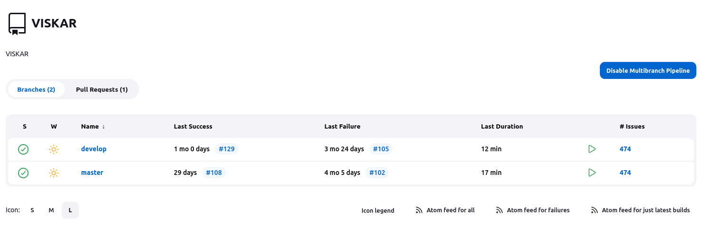

# Development Workflow
Multiple tools are used for the development of Visual KARSYS.

All the passwords and connections elements are available on the [trello](https://trello.com/c/fiEaH7Ua/1063-password-vault)

## Working with Trello
Trello is a web application used to manage the project tasks. It consists of cards that can be arranged in columns.

To each card belongs :

- A set of labels

- A set of members (people who work on the project and have access to the board)

- An activity log recording the changes and the comments made on the card

The card can also be given a due date and / or a check list to monitor the progression of the task it represents. Overall, Trello is pretty intuitive and shouldn’t require more documentation.

## Working with GitHub
We use GitHub to manage our source code and provide version control. We use the [Source Tree Git Flow](https://blog.sourcetreeapp.com/2012/08/01/smart-branching-with-sourcetree-and-git-flow/)
model in the following configuration:

- ``develop`` contains the changes destined for the next release.
- ``master`` contains the currently released version. Only updated by merging develop into it. Updating this branch will *immediately* create and deploy a new release, so be careful!
- ``dev/XYZ`` are feature branches containing a single new feature. A Pull Request (PR) targeting ``develop`` is opened, and once all reviewers have approved the PR it is merged into ``develop``.

The ``develop`` branch should only contain tested changes. The typical workflow when working on a new feature should look like this :

1. Create a new local branch named after the feature you’re planning on implementing, e.g. ``dev/shiny-ponies``.

2. Checkout that branch (if it is not done automatically)

3. Modify the code until you have a preliminary version of your feature working

4. Commit the modifications (or changes) and push your branch to the remote repository

5. Repeat the last two steps until you think your feature is functional and ready to be used in production

6. Create a pull request

7. Wait until your changes are approved by your collaborators

8. Merge your changes into the ``develop`` branch

    1. If there are conflicts, resolve the conflicts : conflicts appear when git cannot decide by itself hich parts of the code to keep between two branches. Git will annotate your code to show you the two conflicting code blocks. Delete the one you don’t want to keep and the annotations to resolved the conflict.

    2. Once you’ve resolved all the conflicts, commit your changes again.

9. If you’re done working on your feature, delete the branch.

Sometimes, it can happen that your feature branch has missed a lot of commits from ``develop`` while you were working on it. In this case, you want to checkout your feature branch, merge ``develop``
into it and push it. Conflicts can also happen here. If it’s the case, follow the two steps above to get rid of them.

### GitHub tips

* Ideally, pull requests are small and focus on one "thing". If you have changes that depend on each other, try to make separate pull requests (PRs) for them, and add a link to the related PR(s).
* Moving, refactoring and formatting code all lead to large diffs. Whenever possible, it's best to do many such changes in separate PRs to separate the real changes.
* Explaining your changes in the PR can be useful - either as a summary in the description, or on a line of code for important changes.
* If changes are requested on your PR, let reviewers know when you think you're ready for a new review.

Moreover, you can monitor the different branches in the insights menu, network tab

## Environments
There is 3 different environments :
- [Local](http://localhost:3000/)
- [Dev](https://dev.visualkarsys.com/)
- [Prod](https://www.visualkarsys.com/)

We work on the local environment, before pushing it on the dev on to test it and finally we put it on the prod environment.

## Jenkins
Jenkins is used to access the two pipelines in the development. The dev and prod pipelines explained before.
Once you're logged in the Jenkins service, you access to the main menu.

In this menu you can see the different options on the left side bar and in the middle screen the current pull request and the two branches who are set with Jenkins

When we select the branches, we can see the two pipelines corresponding to dev and master.

As an example, if we select the develop pipeline, we can see its status and the last few builds.
The pipeline has the different steps listed above and you can observe if the step went correctly or not.

## Grafana
Grafana is a tool used to monitor the server and its activity, it is used to check if there is a problem with the distant server.

We can monitor things such as CPU Usage, load average, memory usage, etc ...

## Hetzner (Server & Backup)
The Hetzner server has the robot interface which help the configuration of the server itself.

With the robot interface we can configure and interact with the distant server machine.

## BRGM Gitlab
The BRGM Gitlab is the git repository with the code for the different APIs used by Visual KARSYS. As a Visual KARSYS, you have to sign up to this repository in case you're in need to modify the base code of these apis

### Create an account on ldap

Provide the following link: Application registration

Do not change the Application Registration and Application Profiles sections.
In the Comment section, add a small comment to say "who what how".

New accounts must validate their e-mail address.

Once the user has been created, if the user has lost his password or wants to change it, he can do so himself via this url: Login - CAS - Central Authentication Service

Translated with www.DeepL.com/Translator (free version)

